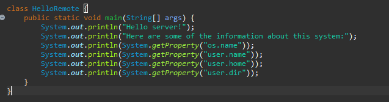

# Lab Report 1
### By Pierre Ellie

##  How to use to Remote Server for your Files.

### Step 1: Setting up Visual Studio Code
1. First begin by install video studio code on your device from this [link](https://code.visualstudio.com/).
    
2. Once on the page, download the installer then run it.
- Due to complications with password changing, the images are from the active directory personal I had used. 
### Step 2: Connecting Remotely
1. Now that we have VScode open, we can open the terminal to connect remotely
2. To open the terminal do Ctrl + ~ or do View > Terminal. 
3. Now, using our account, we will connect remotely by typing
- **ssh accountname@ieng6.ucsd.edu**
- *accountname will be replaced by your specific account*
4. The terminal will then prompt you to enter your password
5. Once logged in, there should be a summary of your login like shown

### Step 3: Commands
1. Now  we can try a couple of commands to explore. Here is a few and what they do
- ls **This lists what is within the directory that you are currently in**
- ls -a **Does the same as ls but shows hidden files**
- cd *path* **This moves to another directory**    
- cat *file* **Prints the contents of the file**
- exit **logs out of the remote server**
2. Let's try a new command: scp. This commad requires a bit of set up though
3. Exit the remote server using the exit command
4. Now on your own machine create a java file called HelloRemote.java with the following code.

5. We will now move this file onto the remote server. In the terminal, write **scp HelloRemote.java accountname@ieng6.ucsd.edu:~/**
- It will ask you to enter your password for your terminal enter it to complete the move.
- If it says that the file HelloRemote.java doesn't exist, try adding the path before it to find the file OR you can use the cd and ls commands to move your terminal into the directory with HelloRemote.java
6. Now that the file is on the server, we can reconnect to it to run the file using the ssh command from before.
7. Compile and run the file by typing **javac HelloRemote.java** then **java HelloRemote** and see the printed results

- We can also see the code of the file with the **cat** command

### Step 4: Setting up an SSH key

1. Notice how we ned to use a password for every movement of files and every time we try logining into the remote server. We can make this process faster by using an SSH key. 
2. On your own computer, trype the command **ssh-keygen**
3. When prompted with file and passphrase, just press enter to have defaults.
- This would be the results

4. This results in a couple files being made as well, if you type **ls -a** you should be able to see then with the names **id_rsa id_rsa.pub**.
5. Now we will create a directory on the server by reconnecting to it and typing **mkdir .ssh**. Then logout of the server using **exit**
6. Now copy the key over using the command **scp /Users/you/.ssh/id_rsa.pub youraccount@ieng6.ucsd.edu:~/.ssh/authorized**.
- Now you might be able to connect to the remote server without a password. This did not work for me though, it still asks for a password but I think this issue might have to do with using my active directory as opposed to the class account.
 
 - It says my Macbook is in the file authorized, yet I still need to type the password to log into it.

 ### Congrats
 - You have worked with the remote server, hopefully no issues came up like for me and now you can move and access the server freely for future works!

